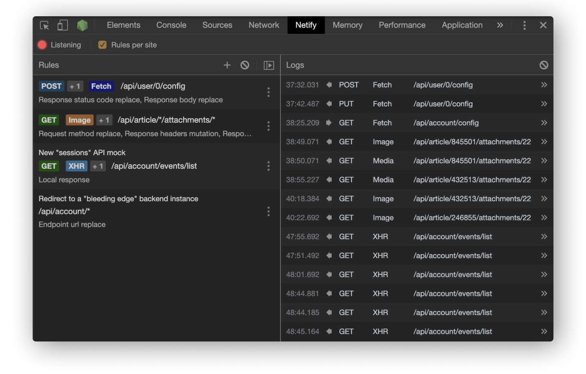

## `Netify`
Netify is a debugging proxy that will allow you to intercept and mutate your requests, like Fiddler or Charles, but it more compact and implemented directly in the Chrome devtools.

### Features that Netify gives you:
- Filter requests for proxy by URL, method or type of resource.
- Redirect request to arbitrary URL.
- Adding, replacing and removing request headers.
- Replacing a request body with text/JSON, Base64 or form data.
- Replacing a response status code.
- Adding, replacing and removing response headers.
- Replacing a response body with a text value, Base64, or file's content.
- Adding an extra response delay
- Cancel requests on the client.  
- The above changes can be made according to predefined rules, by script or by making changes to an intercepted request (like breakpoint).
----

Netify is fully free and open source. You can thank the author by making a small donation  

